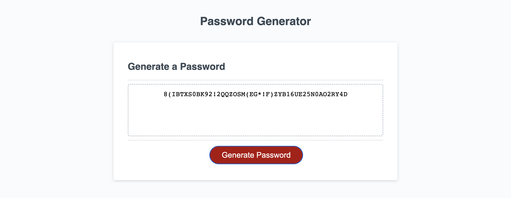

# Password Generator
This application generates a random password based on critera presented to the user through a series of prompts.

Users can choose the length of their password and whether it includes upper case, lower case numbers or special characters. 

Link: https://kevinkraiss.github.io/random-password-generator/

GitHub Repo: https://github.com/kevinkraiss/random-password-generator

